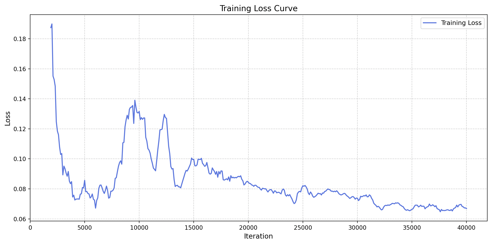
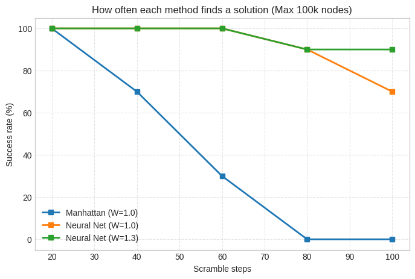
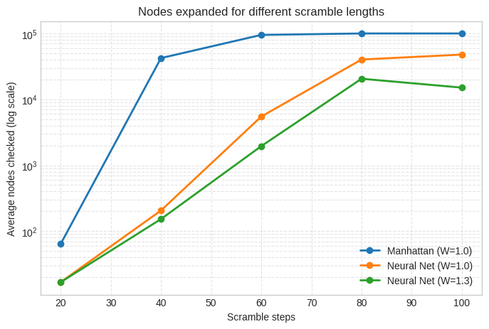
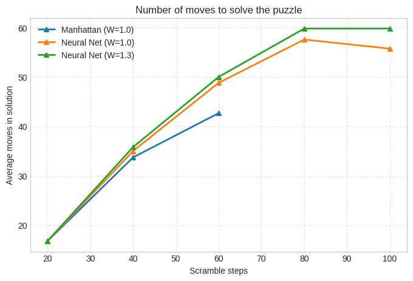

# 24-Puzzle (5x5) DAVI: Architecture Upgrades and Results

## 1. What We Changed from the 3x3 and 4x4 Models

To handle the massive increase in complexity, we completely redesigned the neural architecture and data representation:

* **State Representation (Input):** 
  * *Previous (3x3/4x4):* Fed a coordinate system mapping each tile to its `(row, col)` position (yielding small input dimensions like 18 or 32).
  * *New (5x5):* Shifted to a flattened **625-dimensional one-hot tensor** ($25 \times 25$), removing restrictive spatial biases and allowing the network to learn complex tile interactions.
* **Network Capacity:** 
  * *Previous:* `hidden_dim=256` with 4 standard residual blocks.
  * *New:* Upgraded to `DAVI_Ultra` featuring **`hidden_dim=1024` and 6 residual blocks** to handle the harder value-iteration targets.
* **Normalization & Activations:** 
  * *Previous:* `BatchNorm1d` and standard `ReLU`.
  * *New:* Switched to a **Pre-LayerNorm** structure with **GELU** activations, ensuring stable gradient flow through the deeper network and preventing dead neurons.
* **Output Head:** 
  * *Previous:* Direct linear projection from hidden dimensions to a single scalar.
  * *New:* Added an intermediate projection layer stepping down from `1024 -> 256` (with a GELU activation) before the final scalar output to stabilize regression.

---

## 2. Training Methodology & Optimization

Training a stable value network for the 24-puzzle required replacing static learning schemes with a robust curriculum and stabilization pipeline:

* **Curriculum Data Generation:** Instead of sampling uniformly across all depths, training utilizes a triangular distribution sampler (`random.triangular`) that progressively scales the maximum scramble depth from 5 up to 80 over the course of 50,000 iterations. This prevents early-stage gradient divergence and preserves performance on near-goal states.
* **Scheduled Learning & Optimization:** We replaced the fixed learning rate approach with `AdamW` paired with a **Cosine Annealing Learning Rate Scheduler**, smoothly decaying the learning rate from $2 \times 10^{-4}$ down to $1 \times 10^{-5}$. Weight decay ($1 \times 10^{-5}$) was introduced to regularize weights across the wider 1024-dimensional feature space.
* **Loss Function:** Switched from standard Mean Squared Error (`MSELoss`) to **Huber Loss**. Huber loss is less sensitive to extreme outlier errors during early training phases, preventing gradient explosions when initial heuristic estimates diverge significantly from Bellman targets.
* **Soft Target Network Updates:** Rather than performing hard periodic checkpoints (which introduce sudden target shifts and loss spikes), the target network is updated continuously via **soft Polyak averaging** ($\tau = 0.01$) at every step.
* **Mixed Precision & Scaling:** Enabled automatic mixed precision (`torch.amp`) with a gradient scaler alongside a doubled batch size ($1024$) to accelerate GPU throughput and stabilize gradient estimation.

---

## 3. Benchmark Results & Visual Analysis

We evaluated our trained checkpoint against the traditional Manhattan distance baseline across 5 scramble depths (20 to 100 steps) using a strict limit of 100,000 node expansions.

### Success Rate Analysis

As illustrated in the success rate chart, classical Manhattan distance breaks down rapidly on the 5x5 board. It drops to 30% success at 60 steps and completely fails (0%) at 80 and 100 steps due to hitting the node limit. In contrast, our neural network maintains high reliability, with the weighted variant ($W=1.3$) sustaining a **90% success rate** even at 100 scramble steps.

| Scramble Steps | Manhattan (W=1.0) | Neural Net (W=1.0) | Neural Net (W=1.3) |
| :--- | :--- | :--- | :--- |
| **20** | 100.0% | 100.0% | 100.0% |
| **40** | 70.0% | 100.0% | 100.0% |
| **60** | 30.0% | 100.0% | 100.0% |
| **80** | 0.0% | 90.0% | 90.0% |
| **100** | 0.0% | 70.0% | 90.0% |

### Search Efficiency (Nodes Expanded)

The nodes expanded plot (displayed on a logarithmic scale) clearly highlights the search-space reduction achieved by the neural heuristic. At 40 steps, Manhattan expands over 42,000 nodes, whereas the neural net ($W=1.3$) checks **only ~152 nodes**. At 60 steps, Manhattan approaches its 100k ceiling (~95k nodes), while the neural network keeps the expansion under 2,000 nodes—a massive search efficiency gain.

| Scramble Steps | Manhattan (W=1.0) | Neural Net (W=1.0) | Neural Net (W=1.3) |
| :--- | :--- | :--- | :--- |
| **20** | 63.9 | 16.8 | 16.8 |
| **40** | 42,276.5 | 205.6 | 152.3 |
| **60** | 95,078.3 | 5,477.6 | 1,948.8 |
| **80** | Timeout | 40,224.1 | 20,545.7 |
| **100** | Timeout | 47,798.9 | 15,063.1 |

### Solution Quality (Path Length)

The solution length graph captures the trade-off inherent in using approximate heuristics. Because Manhattan distance is admissible, it produces the shortest paths when it successfully finishes. The neural network introduces slight sub-optimality (~3 to 4 extra moves), and applying the greedy weight ($W=1.3$) pushes the path lengths up slightly further. However, saving tens of thousands of node expansions in exchange for a few extra moves is a highly favorable trade-off for a 5x5 puzzle.

| Scramble Steps | Manhattan (W=1.0) | Neural Net (W=1.0) | Neural Net (W=1.3) |
| :--- | :--- | :--- | :--- |
| **20** | 16.8 | 16.8 | 16.8 |
| **40** | 33.8 | 35.1 | 36.0 |
| **60** | 42.7 | 49.0 | 50.2 |
| **80** | N/A | 57.6 | 59.8 |
| **100** | N/A | 55.8 | 59.8 |

---

## 4. Conclusion

Scaling up to the 24-puzzle required moving away from lightweight coordinate representations and shallow ResNets. By implementing the 625-dimensional one-hot input, a wider 1024-hidden-dim backbone with Pre-LayerNorm, scheduled cosine annealing, and weighted A* search ($W=1.3$), we successfully transformed an intractable 5x5 search problem into a fast, highly reliable solver capable of handling 100-step scrambles.