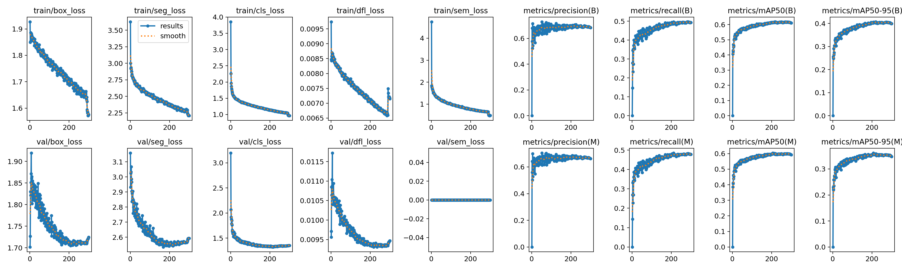
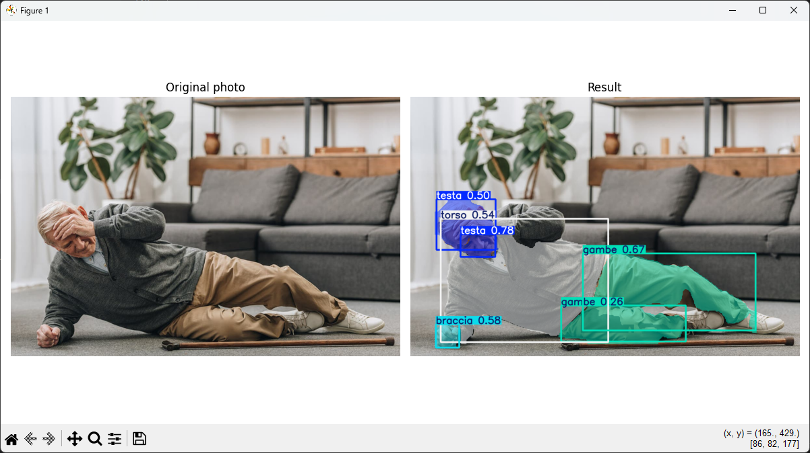
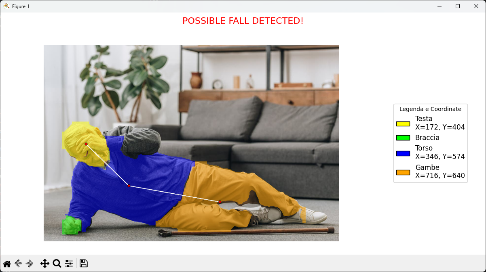
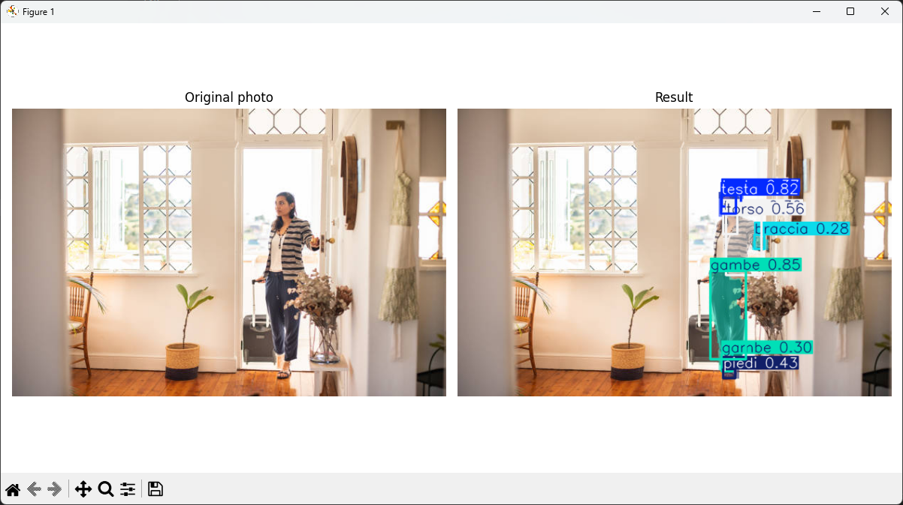
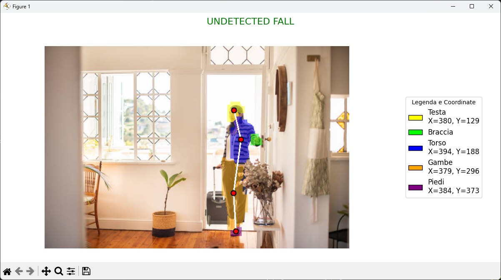
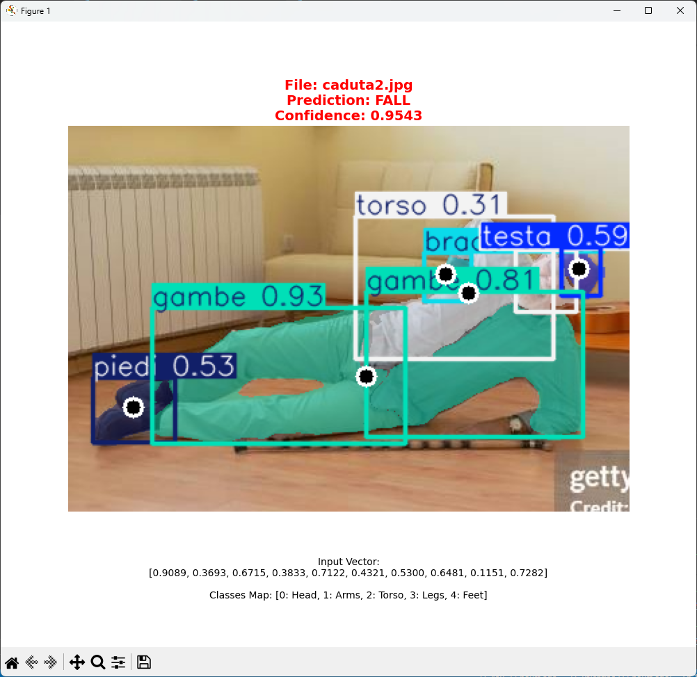

## Digital Image Processing
**Title:** Pose Estimation and Fall Detection

**Description:** Implementation of a training of Yolo-seg network only for certain parts of the human body (head, torso, arms, legs and feet) and study of their mutual positions to understand whether there has been a fall or not.

### Project structure:
`yolo-train.py` is the file we started with to train our yolo segmentation network. The network learns to segment only five body parts: head, torso, arms, legs, and feet. The dataset we used to achieve this is the CIHP Dataset.

The results of the various training phases are located in the `/runs` folder. The dataset is located in the `/assets` folder, which for obvious reasons is not available in the repository.

* **Dataset link:** [https://datasetninja.com/cihp](https://datasetninja.com/cihp)
* **YOLO-seg model used (YOLO26n-seg):** [https://docs.ultralytics.com/it/tasks/segment/#models](https://docs.ultralytics.com/it/tasks/segment/#models)

`image-test.py` and `realtime-test.py` test our segmentation model on images and real-time video recorded by a device camera. Within these two files, the logic used for fall detection is a simple check of the relative positions of the centroids.

`classifier-train.py` and `classifier-test.py` attempt to train and test a classifier that, starting from an input composed solely of centroid positions, attempts to detect a fall. The model works only on images; the training images were not loaded, but only the test images, which are located in `digital-image-processing/test-dataset/images`. One of our best models is stored in `classifier.pth`.

Finally, we have `video-test.py`, the most relevant file in the project, which applies our segmentation model to videos of falls taken from angles that might appear to be captured by surveillance cameras ([https://www.kaggle.com/datasets/tuyenldvn/falldataset-imvia](https://www.kaggle.com/datasets/tuyenldvn/falldataset-imvia)). Here, the fall detection logic is more complex and follows a statistical approach based on the position of some versors connecting the centroids of the segmented person:

* Through an initial calibration phase (which lasts for example 100 frames) a vector of means and a covariance matrix of the positions that the head-torso, torso-legs, head-legs versors assume during this phase are constructed.
* Once the calibration phase is complete, we calculate an anomaly score, frame by frame, equivalent to the Mahalanobis distance between the frame versors and the model built during the calibration phase. The system works even if only one of the three versors is detected.
* If the anomaly score exceeds a certain threshold (for example, 5), the frame is classified as suspicious. When 70% of the last frame window (for example, 15 frames) are suspicious, it is assumed that a crash occurred.

### More details on the implementation:
* Instead of processing the entire frame with YOLO we try to isolate moving pixels. YOLO inference is then strictly restricted to the resulting dynamic Region of Interest (ROI), significantly reducing the computational load.
* To handle partial occlusions the Mahalanobis distance is computed on dynamically extracted sub-matrices corresponding only to the visible features. This ensures that the anomaly score remains mathematically consistent regardless of how many body vectors are currently tracked.

### Final results and conclusions:
Most of the quality of the results is due to the segmentation network.

Although our training was limited due to the computational power we had available, some results are very interesting and are very good at identifying whether a fall occurred or not.

The classifier does not perform very well due to a small training dataset and the limited information a simple fully connected network can learn from the centroid positions alone.

The most robust model is clearly the one used in the `video-test.py` script, although it requires a calibration process.

**Demo:** [Link to a demo of the video-test.py script](https://drive.google.com/file/d/1ZGVnpFPsRR2WGCvzFTyD2hxMs8wFtQEc/view)

**Results:**

<table>
  <tr>
    <td align="center">
      
       
      <i>Yolo-seg training results</i>
    </td>
    </tr>
    <tr>
    <td align="center">
      
       
      <i>image-test.py demo</i>
    </td>
    <td align="center">
      
       
      <i>image-test.py demo</i>
    </td>
  </tr>
  <tr>
    <td align="center">
      
       
      <i>image-test.py demo</i>
    </td>
    <td align="center">
      
       
      <i>image-test.py demo</i>
    </td>
    </tr>
    <tr>
    <td align="center">
      
       
      <i>Classifier test</i>
    </td>
    </tr>
</table>

*Authors: Valentino Basili, Giovanni Paolo Maugeri*